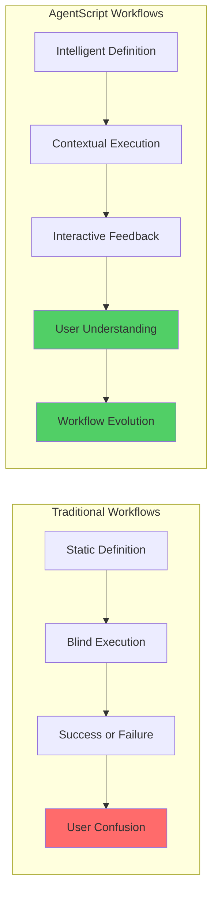
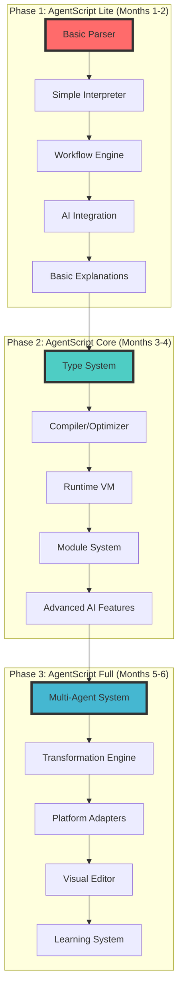
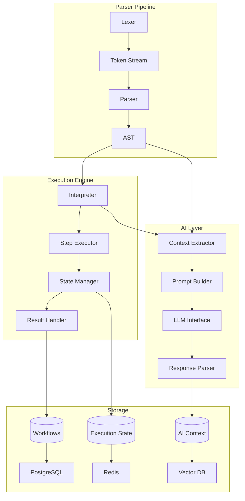
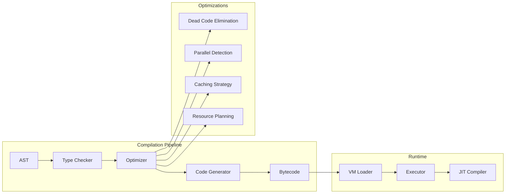
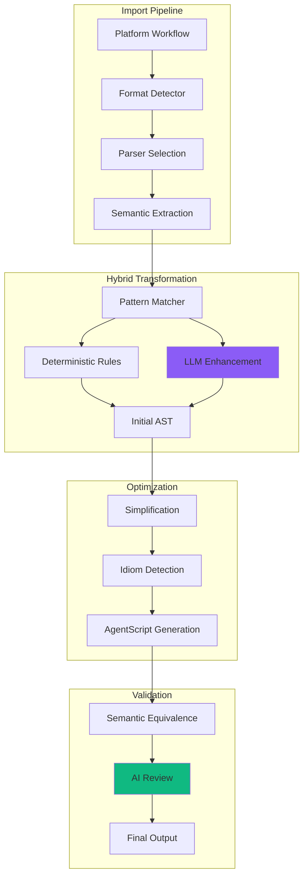
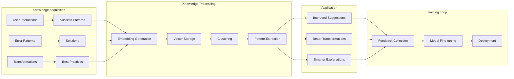
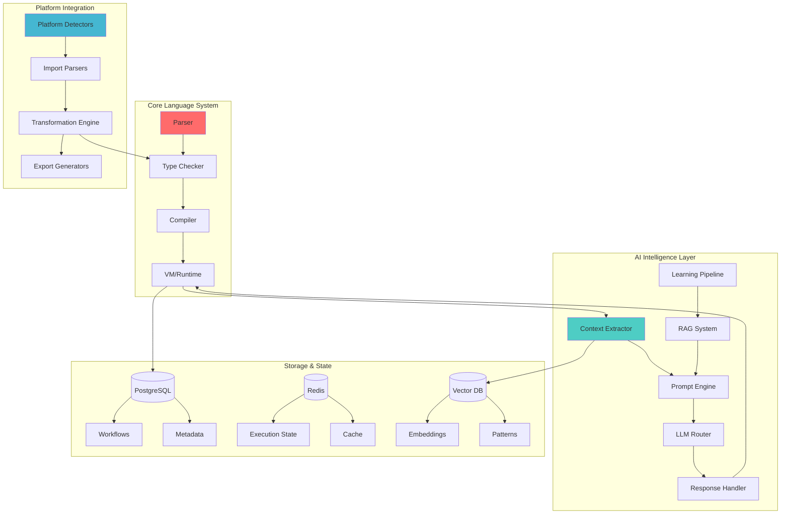

# AgentScript: Architecture & Development Plan

## Executive Summary

AgentScript is the revolutionary language that powers Shimmer's vision of interactive AI-powered workflows. Unlike traditional workflow languages that merely execute instructions, AgentScript enables AI agents to truly understand, explain, modify, and teach workflows in real-time.

Think of AgentScript as the difference between reading sheet music and having a master musician explain why each note matters. This document outlines a 6-month journey to build AgentScript from a simple interpreter to a comprehensive platform that transforms how people create and share automation knowledge.

Our phased approach ensures we deliver value quickly while building toward a game-changing vision: every workflow becomes an intelligent teacher, consultant, and collaborator.

## The AgentScript Vision

Traditional workflow automation treats workflows as black boxes—they run, but they can't explain themselves. AgentScript changes this fundamental limitation by making workflows conversational and adaptive.



AgentScript achieves this through three key innovations:

**Semantic Annotations**: Every workflow step includes context that AI agents use to provide meaningful explanations. These aren't comments—they're structured data that enables deep understanding.

**Platform Agnosticism**: AgentScript can represent workflows from any platform (n8n, Make, Zapier) while preserving their intent and improving their clarity. This universality makes it the perfect interchange format.

**Progressive Intelligence**: The language grows smarter over time, learning from every interaction to provide better explanations, suggestions, and transformations.

## Development Philosophy

Building AgentScript requires balancing several critical concerns:

**Human-First Design**: The syntax must be readable by developers without documentation. If a human struggles to understand it, an AI agent won't be able to explain it well.

**AI-Native Architecture**: Every language feature considers how AI agents will interact with it. We're not retrofitting AI onto an existing language—we're building with AI as a first-class citizen.

**Gradual Complexity**: Users should be productive with basic features while advanced capabilities remain discoverable. The language grows with user expertise.

**Platform Reality**: We must handle the messy reality of different workflow platforms without forcing users to understand platform-specific quirks.

## Three-Phase Development Plan

Our development follows three distinct phases, each building upon the previous while delivering standalone value:



Each phase represents a complete, usable system. Users of AgentScript Lite get immediate value, while we build toward the full vision.

## Phase 1: AgentScript Lite (Months 1-2)

AgentScript Lite focuses on proving the core concept: workflows that can explain themselves. We build just enough language features to demonstrate transformative value.

### Core Language Design

The foundation of AgentScript is its syntax—designed for clarity and AI comprehension:

```yaml
# AgentScript Lite Example
workflow: "Customer Onboarding"
description: "Guides new customers through account setup with validation and personalization"
version: "1.0"
author: "@jane_developer"

context:
  purpose: "Reduce onboarding friction while ensuring data quality"
  success_metrics:
    - "95% completion rate"
    - "Under 5 minutes average time"

steps:
  - id: collect_email
    type: input
    config:
      field_type: "email"
      validation: "RFC5322"
    agent_context:
      why: "Email serves as unique identifier and primary communication channel"
      common_issues: "Users often typo domains like 'gmial.com'"
      suggestions: "Consider adding common typo detection"
    
  - id: verify_email
    type: action
    config:
      service: "email_verification"
      timeout: 300
    agent_context:
      why: "Prevents fake accounts and ensures deliverability"
      failure_handling: "Offer alternative verification via SMS"
      security: "Prevents enumeration attacks with rate limiting"
    
  - id: create_profile
    type: transform
    config:
      input: "${steps.collect_email.value}"
      output: "user_profile"
    agent_context:
      why: "Centralizes user data for personalization"
      data_privacy: "PII is encrypted at rest and in transit"
```

Notice how `agent_context` provides rich information for AI explanations. This isn't just documentation—it's structured data that enables intelligent interactions.

### Technical Architecture (Lite)



### Implementation Details (Lite)

**Parser Development (Weeks 1-2)**

We build the parser using TypeScript and Chevrotain, a powerful parser generator that provides excellent error messages—crucial for AI agents to help users fix issues.

```typescript
// AgentScript Lite Grammar (simplified)
class AgentScriptParser extends CstParser {
  constructor() {
    super(tokens);
    
    this.RULE("workflow", () => {
      this.CONSUME(WorkflowKeyword);
      this.CONSUME(Colon);
      this.CONSUME(StringLiteral);
      this.OPTION(() => {
        this.SUBRULE(this.metadata);
      });
      this.SUBRULE(this.steps);
    });
    
    this.RULE("step", () => {
      this.CONSUME(Dash);
      this.CONSUME(IdKeyword);
      this.CONSUME(Colon);
      this.CONSUME(Identifier);
      this.SUBRULE(this.stepConfig);
      this.OPTION(() => {
        this.SUBRULE(this.agentContext);
      });
    });
    
    this.RULE("agentContext", () => {
      this.CONSUME(AgentContextKeyword);
      this.CONSUME(Colon);
      this.MANY(() => {
        this.SUBRULE(this.contextField);
      });
    });
  }
}
```

The parser generates an Abstract Syntax Tree (AST) that preserves all semantic information, including agent contexts and metadata.

**Interpreter Design (Weeks 2-3)**

The interpreter walks the AST and executes steps sequentially. Even in Lite, we build with concurrency in mind:

```typescript
class AgentScriptInterpreter {
  private executionState: ExecutionState;
  private stateManager: StateManager;
  private contextBuilder: AIContextBuilder;
  
  async executeWorkflow(ast: WorkflowAST, input: any): Promise<ExecutionResult> {
    this.executionState = new ExecutionState(ast.id);
    
    for (const step of ast.steps) {
      try {
        // Build AI context before execution
        const aiContext = this.contextBuilder.buildStepContext(step, this.executionState);
        
        // Execute with monitoring
        const result = await this.executeStep(step, aiContext);
        
        // Update state
        this.executionState.recordStep(step.id, result);
        
        // Allow AI observation
        await this.notifyAIObservers(step, result, aiContext);
        
      } catch (error) {
        return this.handleStepError(step, error);
      }
    }
    
    return this.executionState.buildResult();
  }
  
  private async executeStep(step: StepAST, context: AIContext): Promise<StepResult> {
    const executor = this.getExecutor(step.type);
    return executor.execute(step.config, context, this.executionState);
  }
}
```

**AI Integration Foundation (Weeks 3-4)**

The AI layer enables natural conversations about workflows:

```typescript
class WorkflowAIAgent {
  private llm: LLMInterface;
  private contextRetriever: ContextRetriever;
  private responseGenerator: ResponseGenerator;
  
  async handleUserQuery(
    workflow: WorkflowAST, 
    query: string, 
    executionState?: ExecutionState
  ): Promise<AIResponse> {
    // Extract relevant context from workflow
    const workflowContext = this.extractWorkflowContext(workflow);
    
    // Retrieve similar patterns from knowledge base
    const similarPatterns = await this.contextRetriever.findSimilar(workflow);
    
    // Build comprehensive prompt
    const prompt = this.buildPrompt({
      query,
      workflow: workflowContext,
      currentState: executionState,
      examples: similarPatterns,
      instructions: this.getResponseInstructions(query)
    });
    
    // Generate response with streaming
    const response = await this.llm.generateStream(prompt);
    
    // Parse and enhance response
    return this.responseGenerator.enhance(response, workflow);
  }
  
  private extractWorkflowContext(workflow: WorkflowAST): WorkflowContext {
    return {
      purpose: workflow.context.purpose,
      steps: workflow.steps.map(step => ({
        id: step.id,
        type: step.type,
        agentHints: step.agentContext,
        connections: this.findConnections(step, workflow)
      })),
      patterns: this.identifyPatterns(workflow)
    };
  }
}
```

### Lite Deliverables

By the end of Phase 1, we have:

- Fully functional parser for AgentScript Lite syntax
- Interpreter capable of executing linear workflows
- State management with persistence and rollback
- AI agent that can explain any workflow step
- Basic modification suggestions from AI
- Support for 10-15 common workflow patterns
- Performance baseline: <100ms parse time, <500ms execution per step

## Phase 2: AgentScript Core (Months 3-4)

AgentScript Core introduces robustness and sophistication. We add a type system, compiler optimizations, and advanced language features that enable complex real-world workflows.

### Advanced Language Features

**Type System Design**

Types make workflows safer and AI explanations more precise:

```typescript
// AgentScript Core - Typed Workflows
type Customer = {
  email: string
  name: string  
  tier: "free" | "pro" | "enterprise"
  metadata?: Record<string, any>
}

type EmailTemplate = {
  subject: string
  body: string
  attachments?: Array<{
    name: string
    content: Buffer
  }>
}

workflow<Input: Customer, Output: EmailTemplate> PersonalizedOnboarding {
  description: "Creates personalized onboarding based on customer tier"
  
  context {
    data_flow: "Customer data enriched through multiple services"
    performance: "Optimized for <2s total execution"
  }
  
  step enrich_customer: Transform<Customer, EnrichedCustomer> {
    transform: async (customer) => {
      const enrichment = await ExternalAPI.enrich(customer.email)
      return { ...customer, ...enrichment }
    }
    
    agent_context {
      purpose: "Adds behavioral data for personalization"
      api_limits: "100 requests/minute, implements backoff"
      cache_strategy: "24-hour TTL on enrichment data"
    }
  }
  
  step generate_content: Generate<EnrichedCustomer, EmailTemplate> {
    using: GPT4EmailGenerator
    prompt_template: "onboarding_email_v2"
    
    agent_context {
      personalization: "Adjusts tone and content based on tier and behavior"
      fallback: "Generic template if generation fails"
      quality_check: "Validates no PII leakage in generated content"
    }
  }
}
```

**Module System**

Reusable components accelerate development:

```typescript
// AgentScript Core - Modules
module EmailValidation {
  export validator StandardEmailValidator {
    pattern: /^[^\s@]+@[^\s@]+\.[^\s@]+$/
    
    enhance(email: string): ValidationResult {
      const domain = email.split('@')[1]
      const commonTypos = checkCommonTypos(domain)
      
      return {
        valid: this.pattern.test(email),
        suggestions: commonTypos,
        riskScore: calculateRiskScore(domain)
      }
    }
  }
  
  export transformer EmailNormalizer {
    normalize(email: string): string {
      return email.toLowerCase().trim()
    }
  }
}

// Using modules in workflows
import { StandardEmailValidator, EmailNormalizer } from '@stdlib/email'

workflow EmailSignup {
  step validate {
    use: StandardEmailValidator
    on_invalid: retry_with_suggestions
  }
}
```

### Compiler and Optimization

The compiler transforms AgentScript into optimized bytecode:



```typescript
class AgentScriptCompiler {
  private typeChecker: TypeChecker;
  private optimizer: Optimizer;
  private codeGen: CodeGenerator;
  
  compile(ast: WorkflowAST): CompiledWorkflow {
    // Phase 1: Type checking with inference
    const typedAST = this.typeChecker.check(ast);
    
    // Phase 2: Optimization passes
    const optimizedAST = this.optimizer.optimize(typedAST, {
      enableParallelization: true,
      enableCaching: true,
      targetRuntime: RuntimeVersion.CORE
    });
    
    // Phase 3: Generate bytecode
    const bytecode = this.codeGen.generate(optimizedAST);
    
    // Phase 4: Create execution plan
    const executionPlan = this.createExecutionPlan(optimizedAST);
    
    return {
      bytecode,
      metadata: this.extractMetadata(optimizedAST),
      executionPlan,
      aiContext: this.preserveAIContext(ast)
    };
  }
  
  private createExecutionPlan(ast: OptimizedAST): ExecutionPlan {
    const dependencies = this.analyzeDependencies(ast);
    const parallelGroups = this.identifyParallelGroups(dependencies);
    const resourceRequirements = this.estimateResources(ast);
    
    return {
      stages: this.buildExecutionStages(parallelGroups),
      resources: resourceRequirements,
      checkpoints: this.identifyCheckpoints(ast),
      aiObservationPoints: this.markAIObservationPoints(ast)
    };
  }
}
```

### Runtime VM

The VM provides sandboxed execution with monitoring:

```typescript
class AgentScriptVM {
  private executionContexts: Map<string, ExecutionContext>;
  private resourceMonitor: ResourceMonitor;
  private securitySandbox: SecuritySandbox;
  
  async execute(compiled: CompiledWorkflow, input: any): Promise<ExecutionResult> {
    const context = this.createContext(compiled);
    
    try {
      // Set resource limits
      this.resourceMonitor.setLimits(context.id, {
        memory: compiled.metadata.estimatedMemory * 1.5,
        cpu: compiled.metadata.estimatedCPU,
        timeout: compiled.metadata.timeout || 30000
      });
      
      // Execute in sandbox
      const result = await this.securitySandbox.run(async () => {
        return this.runBytecode(compiled.bytecode, context, input);
      });
      
      // Record execution metrics for AI learning
      await this.recordMetrics(context, result);
      
      return result;
      
    } finally {
      this.cleanupContext(context);
    }
  }
  
  private async runBytecode(
    bytecode: Bytecode, 
    context: ExecutionContext, 
    input: any
  ): Promise<any> {
    const vm = new BytecodeInterpreter(context);
    
    // Hook for AI observation
    vm.onStepComplete = async (step, result) => {
      await this.notifyAIObservers(step, result, context);
    };
    
    return vm.interpret(bytecode, input);
  }
}
```

### Core Deliverables

Phase 2 delivers a production-ready system:

- Complete type system with inference
- Optimizing compiler with 3-5x performance improvements
- Secure VM with resource isolation
- Module system with standard library
- Advanced control flow (conditionals, loops, error handling)
- Debug tooling with step-through debugging
- Performance: <50ms compilation, <100ms/step execution

## Phase 3: AgentScript Full (Months 5-6)

The final phase transforms AgentScript into a comprehensive platform that handles any workflow complexity and enables seamless collaboration between humans and AI.

### Multi-Agent Orchestration

Complex workflows benefit from specialized AI agents working together:

```typescript
// AgentScript Full - Multi-Agent Workflows
orchestration CustomerSuccessTeam {
  agents {
    analyst: Agent<DataAnalyst> {
      model: "gpt-4-turbo"
      specialization: "customer behavior patterns"
      tools: ["sql", "statistics", "visualization"]
    }
    
    strategist: Agent<StrategyAdvisor> {
      model: "claude-3-opus"
      specialization: "retention strategies"
      context: "SaaS B2B best practices"
    }
    
    communicator: Agent<ContentCreator> {
      model: "specialized-outreach-model"
      specialization: "personalized messaging"
      tone: "professional but warm"
    }
  }
  
  workflow analyze_and_engage(customer: Customer) {
    // Agents work in parallel with coordination
    parallel {
      analyst_insights = analyst.analyze {
        query: "Identify usage patterns and risk indicators"
        data_source: customer.activity_log
        output_format: "structured_insights"
      }
      
      historical_context = strategist.research {
        query: "Similar customer success stories"
        industry: customer.industry
        company_size: customer.size
      }
    }
    
    // Coordination point - agents share context
    strategy = strategist.synthesize {
      insights: analyst_insights
      context: historical_context
      goal: "Maximize retention probability"
    }
    
    // Final agent uses combined intelligence
    outreach = communicator.create {
      strategy: strategy
      customer_profile: customer
      deliverables: ["email", "success_plan", "meeting_agenda"]
    }
    
    return {
      insights: analyst_insights,
      strategy: strategy,
      outreach: outreach
    }
  }
}
```

### Workflow Transformation Engine

The crown jewel of AgentScript Full is its ability to understand and transform workflows from any platform:



The transformation engine uses our hybrid approach:

```typescript
class UniversalTransformationEngine {
  private platformParsers: Map<Platform, PlatformParser>;
  private patternLibrary: PatternLibrary;
  private llmTransformer: LLMTransformer;
  private semanticValidator: SemanticValidator;
  
  async transform(
    sourceWorkflow: any, 
    sourcePlatform: Platform
  ): Promise<AgentScriptWorkflow> {
    // Step 1: Platform-specific parsing
    const parser = this.platformParsers.get(sourcePlatform);
    const platformAST = await parser.parse(sourceWorkflow);
    
    // Step 2: Extract semantic intent
    const semanticGraph = this.extractSemantics(platformAST);
    
    // Step 3: Hybrid transformation
    const agentScriptAST = await this.hybridTransform(semanticGraph, {
      deterministicFirst: true,
      llmEnhancement: true,
      preserveIntent: true
    });
    
    // Step 4: Optimization passes
    const optimized = await this.optimize(agentScriptAST);
    
    // Step 5: AI enhancement
    const enhanced = await this.enhanceWithAI(optimized, platformAST);
    
    // Step 6: Validation
    await this.validate(enhanced, semanticGraph);
    
    return enhanced;
  }
  
  private async hybridTransform(
    semantics: SemanticGraph, 
    options: TransformOptions
  ): Promise<WorkflowAST> {
    // First pass: Deterministic transformation
    const patterns = this.patternLibrary.findMatches(semantics);
    let ast = this.applyPatterns(patterns, semantics);
    
    // Second pass: LLM enhancement for complex logic
    const complexNodes = this.identifyComplexNodes(semantics, ast);
    
    for (const node of complexNodes) {
      const enhanced = await this.llmTransformer.enhanceNode({
        node,
        context: semantics.getContext(node),
        targetStyle: "idiomatic_agentscript",
        preserveSemantics: true
      });
      
      ast = this.replaceNode(ast, node.id, enhanced);
    }
    
    // Third pass: Add AI context annotations
    ast = await this.addAIAnnotations(ast, semantics);
    
    return ast;
  }
}
```

### RAG-Powered Learning System

The system continuously improves through every interaction:



```typescript
class LearningSystem {
  private ragStore: RAGKnowledgeStore;
  private trainingPipeline: TrainingPipeline;
  private feedbackCollector: FeedbackCollector;
  
  async learnFromInteraction(interaction: UserInteraction): Promise<void> {
    // Extract learning opportunities
    const learningData = this.extractLearningData(interaction);
    
    // Store in RAG system for immediate use
    await this.ragStore.addExamples({
      workflow: learningData.workflow,
      query: learningData.userQuery,
      response: learningData.aiResponse,
      success: learningData.userSatisfaction > 4,
      patterns: this.extractPatterns(learningData)
    });
    
    // Queue for model training if high quality
    if (this.isHighQualityInteraction(learningData)) {
      await this.trainingPipeline.queue({
        input: this.formatTrainingInput(learningData),
        output: this.formatTrainingOutput(learningData),
        metadata: {
          platform: learningData.platform,
          complexity: learningData.complexity,
          patterns: learningData.patterns
        }
      });
    }
    
    // Update pattern library
    await this.updatePatternLibrary(learningData);
  }
  
  async enhanceWithLearning(
    query: string, 
    workflow: Workflow
  ): Promise<EnhancedResponse> {
    // Find similar successful interactions
    const similar = await this.ragStore.findSimilar({
      query,
      workflow,
      limit: 10,
      minSimilarity: 0.8
    });
    
    // Extract successful patterns
    const patterns = this.extractSuccessPatterns(similar);
    
    // Apply learned optimizations
    return {
      baseResponse: await this.generateResponse(query, workflow),
      learnedEnhancements: patterns,
      confidence: this.calculateConfidence(similar),
      suggestions: this.generateSuggestions(patterns, workflow)
    };
  }
}
```

### Visual Script Editor Integration

The visual editor provides intuitive workflow creation while maintaining full AgentScript power:

```typescript
class VisualEditorBridge {
  private nodeLibrary: NodeLibrary;
  private layoutEngine: LayoutEngine;
  private bidirectionalSync: BidirectionalSync;
  
  async visualToAgentScript(visualWorkflow: VisualWorkflow): Promise<string> {
    // Convert visual nodes to AgentScript AST
    const ast = this.convertNodesToAST(visualWorkflow.nodes);
    
    // Preserve visual metadata as agent context
    const enhancedAST = this.addVisualContext(ast, visualWorkflow.layout);
    
    // Generate clean AgentScript
    return this.generateAgentScript(enhancedAST);
  }
  
  async agentScriptToVisual(script: string): Promise<VisualWorkflow> {
    // Parse AgentScript
    const ast = await this.parseAgentScript(script);
    
    // Generate visual nodes
    const nodes = this.generateVisualNodes(ast);
    
    // Calculate optimal layout
    const layout = await this.layoutEngine.calculate(nodes);
    
    // Preserve agent context as visual hints
    this.addVisualHints(nodes, ast);
    
    return {
      nodes,
      layout,
      metadata: this.extractMetadata(ast)
    };
  }
}
```

### Full Version Deliverables

The complete AgentScript platform includes:

- Multi-agent orchestration with specialized AI collaboration
- Universal workflow transformation supporting 10+ platforms
- Continuous learning system with RAG and model fine-tuning
- Visual editor with bidirectional sync
- Performance: <25ms parse, <50ms/step execution, <2s for complex transformations
- 95%+ semantic preservation in transformations
- Support for workflows with 1000+ steps

## Implementation Timeline

### Month 1: Foundation
**Week 1-2: Language Design & Parser**
- Finalize AgentScript Lite syntax specification
- Implement lexer with comprehensive token types
- Build parser with excellent error recovery
- Create AST structure with AI context preservation
- Develop initial test suite (500+ parser tests)

**Week 3-4: Interpreter & Basic Execution**
- Implement tree-walking interpreter
- Build step execution framework
- Create state management system
- Implement basic error handling
- Develop execution monitoring hooks

### Month 2: AI Integration
**Week 5-6: LLM Integration & Context System**
- Design AI context extraction from AST
- Implement LLM abstraction layer
- Create prompt engineering framework
- Build streaming response handler
- Develop conversation state management

**Week 7-8: Interactive Features**
- Implement workflow explanation system
- Build modification suggestion engine
- Create interactive debugging features
- Develop feedback collection system
- Launch internal testing program

### Month 3: Type System & Compiler
**Week 9-10: Type System Implementation**
- Design type syntax and semantics
- Implement type checker with inference
- Create type-safe module system
- Build generic type support
- Develop type error explanations

**Week 11-12: Compiler Development**
- Implement optimization passes
- Build bytecode generator
- Create execution planner
- Develop JIT compilation hooks
- Benchmark performance improvements

### Month 4: Runtime & Advanced Features
**Week 13-14: VM Implementation**
- Build bytecode interpreter
- Implement security sandbox
- Create resource monitoring
- Develop checkpoint system
- Build distributed execution support

**Week 15-16: Advanced Language Features**
- Implement parallel execution blocks
- Build error handling constructs
- Create event system
- Develop debugging API
- Polish developer experience

### Month 5: Platform Integration
**Week 17-18: Transformation Engine Core**
- Build platform detection system
- Implement deterministic parsers
- Create pattern matching engine
- Develop LLM transformation pipeline
- Build validation framework

**Week 19-20: Platform Adapters**
- Implement n8n adapter (complete)
- Build Make.com adapter
- Create Zapier adapter (beta)
- Develop generic JSON adapter
- Test with real-world workflows

### Month 6: Learning & Polish
**Week 21-22: RAG System & Learning**
- Implement vector storage pipeline
- Build similarity search system
- Create pattern extraction engine
- Develop training data pipeline
- Launch learning system beta

**Week 23-24: Final Integration & Polish**
- Complete visual editor integration
- Finalize multi-agent orchestration
- Performance optimization sweep
- Security audit and fixes
- Documentation and examples

## Technical Architecture Deep Dive

### System Components



### Performance Targets

Performance is critical for user experience and AI responsiveness:

**Parser Performance**
- Goal: <50ms for 1000-line workflows
- Strategy: Incremental parsing, caching, parallel lexing
- Measurement: Continuous benchmarking in CI

**Execution Performance**
- Goal: <100ms per step average
- Strategy: JIT compilation, smart caching, parallel execution
- Measurement: Real-world workflow profiling

**AI Response Time**
- Goal: <2s for explanations, <5s for modifications
- Strategy: Context pre-computation, response streaming, smart caching
- Measurement: User-perceived latency tracking

**Transformation Performance**
- Goal: <3s for platform imports
- Strategy: Hybrid approach, pattern caching, parallel processing
- Measurement: Platform-specific benchmarks

### Security Architecture

Security is foundational, not an afterthought:

```typescript
class SecurityFramework {
  // Execution isolation
  sandboxing: {
    processIsolation: true,
    resourceLimits: true,
    networkRestrictions: true
  },
  
  // Data protection
  encryption: {
    atRest: "AES-256-GCM",
    inTransit: "TLS 1.3",
    keyManagement: "AWS KMS"
  },
  
  // Access control
  authorization: {
    model: "RBAC with attributes",
    granularity: "step-level",
    audit: "comprehensive logging"
  },
  
  // AI safety
  aiSafety: {
    promptInjectionPrevention: true,
    outputValidation: true,
    rateLimiting: true
  }
}
```

## Success Metrics

### Technical Metrics

**Language Adoption**
- Month 2: 100+ workflows created
- Month 4: 1,000+ workflows
- Month 6: 10,000+ workflows

**Performance Benchmarks**
- Parser: 95th percentile <100ms
- Execution: 95th percentile <200ms/step
- AI Response: 95th percentile <3s

**Quality Indicators**
- Type safety: 90%+ of workflows typed
- AI accuracy: 85%+ user satisfaction
- Transformation fidelity: 95%+ semantic preservation

### Business Metrics

**User Engagement**
- AI conversations per workflow: 10+
- Fork rate: 20%+ of viewed workflows
- Modification success rate: 80%+

**Platform Growth**
- Platform coverage: 5+ major platforms
- Module library: 100+ reusable components
- Community contributions: 50+ modules/month

**Learning Effectiveness**
- Pattern recognition improvement: 20%+ monthly
- Suggestion acceptance rate: 60%+
- Support ticket reduction: 40%+

## Risk Management

### Technical Risks & Mitigation

**LLM Reliability**
- Risk: AI service outages or quality issues
- Mitigation: Multi-provider support, fallback strategies, response caching

**Performance Degradation**
- Risk: Complex workflows causing slowdowns
- Mitigation: Aggressive optimization, execution limits, performance monitoring

**Platform API Changes**
- Risk: Breaking changes in integrated platforms
- Mitigation: Version detection, adapter abstraction, graceful degradation

### Strategic Risks & Mitigation

**Complexity Creep**
- Risk: Language becomes too complex
- Mitigation: User feedback loops, simplicity metrics, regular reviews

**AI Hallucination**
- Risk: Incorrect transformations or explanations
- Mitigation: Validation layers, confidence scoring, human review options

**Adoption Barriers**
- Risk: Learning curve too steep
- Mitigation: Progressive disclosure, excellent docs, AI-assisted learning

## Future Vision

While this plan covers 6 months, AgentScript's potential extends far beyond:

**Year 2 Possibilities**
- WebAssembly runtime for browser execution
- Mobile SDK for offline workflows
- Blockchain verification for critical workflows
- Advanced AI agents with memory and learning
- Federated workflow execution

**Long-term Research**
- Formal verification of workflows
- Natural language workflow definition
- Cross-organization workflow sharing
- AI-driven workflow optimization
- Quantum-resistant security

## Implementation Checklist

### Month 1-2 (AgentScript Lite)
- [ ] Language specification document
- [ ] Parser implementation with tests
- [ ] AST design with AI context
- [ ] Basic interpreter
- [ ] State management system
- [ ] Simple workflow execution
- [ ] LLM integration framework
- [ ] Context extraction system
- [ ] Basic chat interface
- [ ] Workflow explanation feature
- [ ] Modification suggestions
- [ ] Error handling system
- [ ] Performance benchmarks
- [ ] Initial documentation
- [ ] Internal testing program

### Month 3-4 (AgentScript Core)
- [ ] Type system design
- [ ] Type checker implementation
- [ ] Generic type support
- [ ] Module system
- [ ] Standard library modules
- [ ] Compiler architecture
- [ ] Optimization passes
- [ ] Bytecode generation
- [ ] VM implementation
- [ ] Security sandbox
- [ ] Resource monitoring
- [ ] Advanced control flow
- [ ] Event system
- [ ] Debug tooling
- [ ] Performance improvements

### Month 5-6 (AgentScript Full)
- [ ] Multi-agent orchestration
- [ ] Agent coordination protocol
- [ ] Platform detection system
- [ ] n8n adapter
- [ ] Make.com adapter
- [ ] Zapier adapter (beta)
- [ ] Transformation engine
- [ ] Hybrid transformation pipeline
- [ ] Validation framework
- [ ] RAG system setup
- [ ] Learning pipeline
- [ ] Pattern extraction
- [ ] Visual editor bridge
- [ ] Bidirectional sync
- [ ] Final optimizations

## Conclusion

AgentScript represents a fundamental shift in how we think about workflow automation. By making workflows conversational, understandable, and adaptive, we're not just building a language—we're creating a new paradigm for human-AI collaboration in automation.

This 6-month plan takes us from concept to comprehensive platform, with each phase delivering immediate value while building toward the larger vision. The phased approach reduces risk, allows for learning and iteration, and ensures we build what users actually need.

The key to success lies in maintaining focus on our core innovation: workflows that can explain themselves, learn from interactions, and adapt to user needs. Every technical decision serves this vision, creating a system that becomes more valuable with every use.

AgentScript isn't just about making workflows easier—it's about democratizing automation expertise and creating a future where anyone can build, understand, and improve complex automations with AI as their guide. The journey starts now.