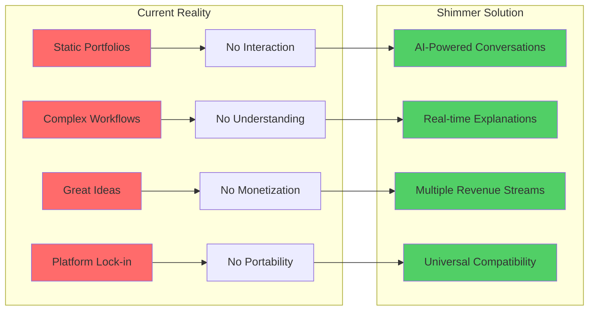
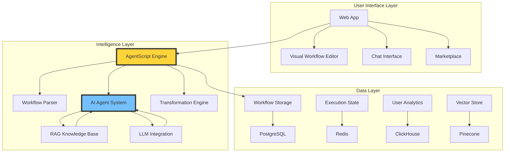
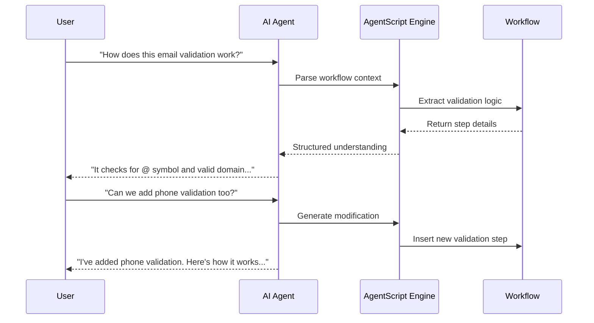
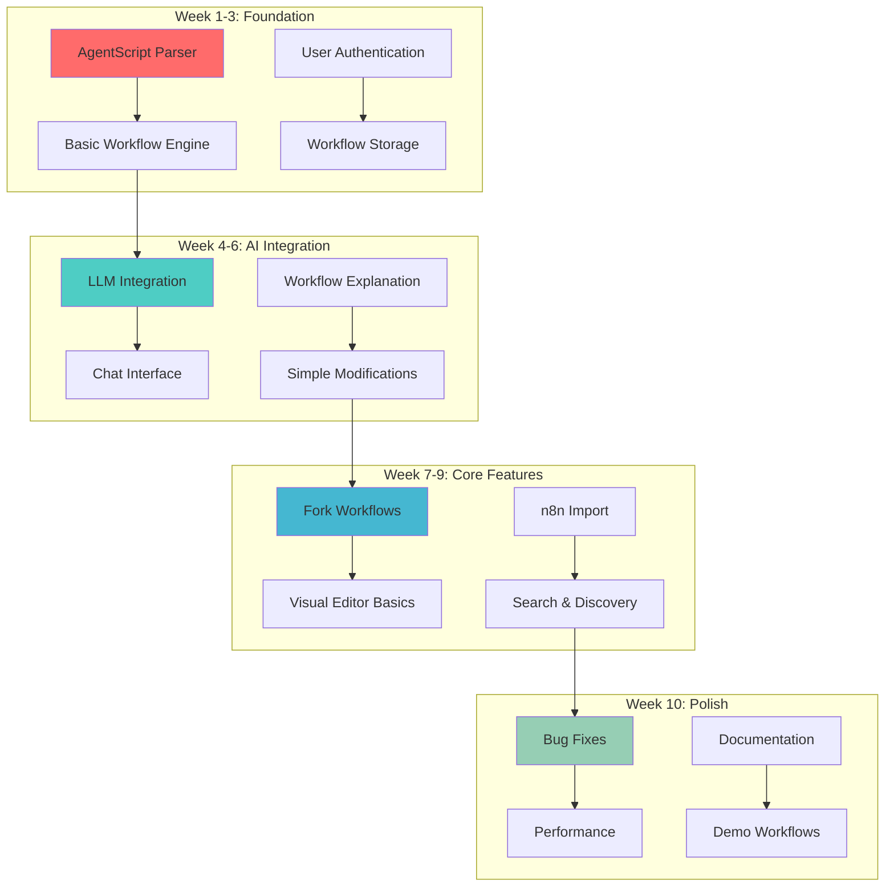
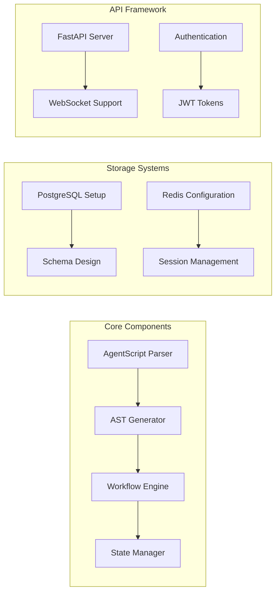
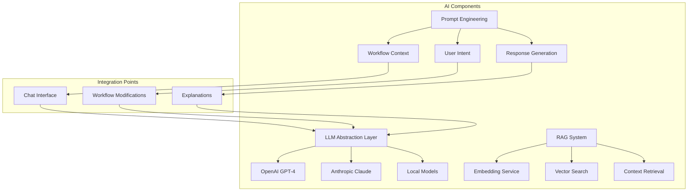
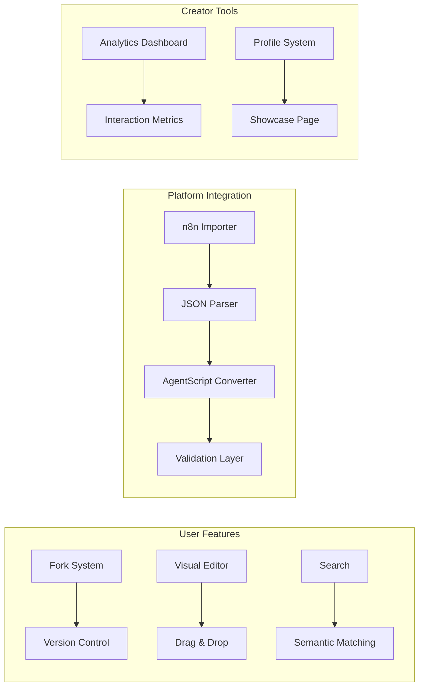
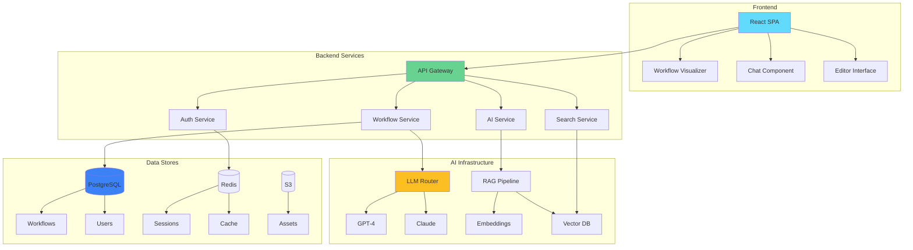

# Shimmer Platform MVP - Architecture & Build Plan

## Executive Summary

Shimmer transforms the way professionals create, share, and monetize AI-powered workflows. Unlike static portfolio sites where you can only view someone's work, Shimmer makes workflows interactive—you can talk to them, understand them, modify them, and make them your own.

Imagine GitHub meets Behance, powered by AI agents that explain and adapt workflows in real-time. Our 10-week MVP will demonstrate this revolutionary approach to workflow automation, focusing on immediate value delivery while building a foundation for exponential growth.

**Key Innovation**: AgentScript—our proprietary language that enables AI agents to truly understand workflows, not just execute them. This allows any workflow to become a teacher, consultant, and collaborator.

## The Problem We're Solving

Current workflow platforms fail creators and users in fundamental ways:



Consider this scenario: A developer creates an amazing customer onboarding workflow. Today, they can only share screenshots or videos. With Shimmer, visitors can:
- Ask the workflow how it handles edge cases
- Fork it and adapt it for their industry
- Get step-by-step guidance while building
- Pay for personalized consultations

## Platform Architecture Overview

Our architecture consists of three main layers working in harmony:



## AgentScript: The Heart of Shimmer

AgentScript is our domain-specific language that makes workflows truly intelligent. Think of it as the difference between a recipe card (traditional workflow) and having a master chef explain each step as you cook (AgentScript-powered workflow).

### How AgentScript Works



### AgentScript Syntax Example

AgentScript is designed to be readable by humans and AI alike:

```yaml
workflow: "Customer Onboarding"
version: "1.0"
creator: "@sarah_martinez"

steps:
  - id: collect_info
    type: form
    agent_hint: "Gathers essential customer data for account creation"
    fields:
      - name: email
        type: string
        validation: email_format
        required: true
        agent_hint: "Primary communication channel"
      
  - id: verify_email
    type: verification
    agent_hint: "Ensures email ownership before account activation"
    method: send_code
    timeout: 15_minutes
    on_success: create_account
    on_failure: retry_or_support
    
  - id: create_account
    type: database_operation
    agent_hint: "Establishes user profile in our system"
    operation: insert
    table: customers
    data:
      email: ${steps.collect_info.fields.email}
      verified: true
      created_at: ${now()}
```

The `agent_hint` annotations are what make AgentScript special—they give AI agents the context needed to explain, modify, and improve workflows intelligently.

## MVP Features (10 Weeks)

Our MVP focuses on demonstrating core value while building a solid foundation:



### Core User Journeys

**Journey 1: The Learner**
Sarah, a marketing manager, discovers a social media automation workflow. She doesn't understand the API integration step. She asks the AI agent, which explains it using her existing WordPress knowledge as a reference point. She modifies the workflow for her company's needs with AI guidance.

**Journey 2: The Builder**
Alex, a developer, finds a payment processing workflow. He forks it, and the AI helps him adapt it from Stripe to PayPal, explaining the differences and handling edge cases. What would take days now takes hours.

**Journey 3: The Creator**
Maria shares her data analysis workflow. Users interact with it 500 times, generating questions that help her create a paid course. She earns revenue from workflow licenses, consultations, and educational content.

## Technical Implementation Plan

### Phase 1: Foundation (Weeks 1-3)

We begin by building the core infrastructure that everything else depends on:



**AgentScript Parser Development**
The parser is our foundation. We'll implement it using TypeScript and Chevrotain for robust grammar handling. The parser must handle basic workflow structures, validate syntax, and generate meaningful error messages that AI agents can explain to users.

**Workflow Engine Architecture**
Our workflow engine executes AgentScript with these key capabilities:
- Step-by-step execution with state preservation
- Rollback capabilities for error recovery
- Hook system for AI agent observations
- Performance monitoring for optimization insights

### Phase 2: AI Integration (Weeks 4-6)

This phase brings workflows to life with AI capabilities:



**Intelligent Workflow Interaction**
We implement a chat interface where users can have natural conversations with workflows. The AI understands workflow context, user intent, and can provide helpful explanations or suggest modifications. This isn't just a chatbot—it's an AI that truly comprehends the workflow's purpose and mechanics.

**RAG System Foundation**
Even in the MVP, we establish a basic RAG system that stores successful interactions, common questions, and workflow patterns. This immediately improves response quality and lays groundwork for future learning capabilities.

### Phase 3: Core Features (Weeks 7-9)

With the foundation and AI in place, we build the features users will love:



**Fork and Remix Workflow**
Users can fork any public workflow with one click. The system creates a copy, preserves attribution, and allows modifications. The AI agent understands both the original and forked versions, helping users adapt workflows to their needs.

**Platform Import System**
We start with n8n import as proof of concept. The hybrid transformation system (deterministic parsing + LLM enhancement) converts n8n JSON to clean AgentScript, making workflows more understandable and modifiable.

### Phase 4: Polish and Launch (Week 10)

The final week focuses on reliability and user experience:

- Performance optimization (sub-2s workflow loads)
- Comprehensive error handling with user-friendly messages
- Demo workflows showcasing platform capabilities
- Documentation for both users and developers
- Load testing and security audit

## MVP System Architecture

Here's how all components work together in our MVP:



## Workflow Transformation Engine

One of our key innovations is the ability to import workflows from other platforms:

```mermaid
graph LR
    subgraph "Import Process"
        A[Platform Workflow] --> B[Format Detection]
        B --> C[Deterministic Parser]
        C --> D[Structure Extraction]
    end
    
    subgraph "Transformation"
        D --> E[Pattern Matching]
        E --> F[LLM Enhancement]
        F --> G[AgentScript Generation]
    end
    
    subgraph "Validation"
        G --> H[Syntax Check]
        H --> I[Semantic Validation]
        I --> J[AI Review]
    end
    
    subgraph "Output"
        J --> K[Clean AgentScript]
        K --> L[Agent Hints Added]
        L --> M[Ready for Use]
    end
    
    style F fill:#8b5cf6
    style J fill:#10b981
```



The transformation engine uses a hybrid approach:

1. **Deterministic Parsing** handles 80% of common patterns reliably
2. **LLM Enhancement** interprets complex logic and adds helpful context
3. **Validation Loop** ensures correctness and readability
4. **AI Annotation** adds agent hints for better explanations

## Implementation Timeline

### Week 1-2: Foundation Sprint
**Goal**: Basic AgentScript parser and workflow engine running

Monday-Wednesday (Week 1):
- Set up development environment and CI/CD pipeline
- Design AgentScript grammar specification
- Implement tokenizer and lexer
- Create initial parser tests

Thursday-Friday (Week 1):
- Build AST (Abstract Syntax Tree) generator
- Implement basic workflow engine
- Create simple workflow execution tests

Monday-Wednesday (Week 2):
- Design database schema for workflows and users
- Set up PostgreSQL and Redis
- Implement workflow storage service
- Create basic API structure with FastAPI

Thursday-Friday (Week 2):
- Build authentication system with JWT
- Implement user registration and login
- Create workflow CRUD operations
- Integration testing for core systems

### Week 3-4: State and Persistence
**Goal**: Workflows can be saved, loaded, and maintain state

Monday-Wednesday (Week 3):
- Implement workflow state management
- Build execution history tracking
- Create rollback functionality
- Design session management system

Thursday-Friday (Week 3):
- Build workflow versioning system
- Implement draft/published states
- Create workflow metadata structure
- Performance optimization for state operations

Monday-Wednesday (Week 4):
- Set up LLM integration framework
- Create prompt templates for workflow understanding
- Build context extraction from AgentScript
- Implement streaming response handling

Thursday-Friday (Week 4):
- Create chat interface backend
- Build conversation state management
- Implement rate limiting for AI calls
- Test AI responses with sample workflows

### Week 5-6: AI Intelligence Layer
**Goal**: Users can chat with workflows and get intelligent responses

Monday-Wednesday (Week 5):
- Build workflow explanation system
- Create step-by-step guidance generator
- Implement question detection and routing
- Design modification suggestion system

Thursday-Friday (Week 5):
- Set up RAG infrastructure with Pinecone
- Create embedding pipeline for workflows
- Build semantic search functionality
- Implement context retrieval system

Monday-Wednesday (Week 6):
- Create workflow modification API
- Build AI-assisted editing features
- Implement validation for AI suggestions
- Create feedback loop for improvements

Thursday-Friday (Week 6):
- Build React frontend foundation
- Create chat UI component
- Implement workflow visualization
- Design responsive layout system

### Week 7-8: User Features
**Goal**: Fork workflows, visual editing, and platform import

Monday-Wednesday (Week 7):
- Implement fork functionality
- Build attribution system
- Create workflow comparison tools
- Design permission management

Thursday-Friday (Week 7):
- Build basic visual editor
- Implement drag-and-drop for steps
- Create step configuration panels
- Build real-time preview system

Monday-Wednesday (Week 8):
- Build n8n import system
- Create JSON parsing logic
- Implement transformation rules
- Build validation layer

Thursday-Friday (Week 8):
- Create workflow search system
- Implement filtering and sorting
- Build recommendation engine
- Create trending workflows algorithm

### Week 9: Creator Features
**Goal**: Analytics, profiles, and monetization foundation

Monday-Wednesday (Week 9):
- Build analytics dashboard
- Create interaction tracking
- Implement view/fork/chat metrics
- Design insights generation

Thursday-Friday (Week 9):
- Build creator profile system
- Create showcase pages
- Implement following system
- Build notification framework

### Week 10: Polish and Launch Preparation
**Goal**: Production-ready MVP with demo content

Monday-Tuesday:
- Performance optimization sweep
- Security audit and fixes
- Error handling improvements
- Load testing

Wednesday-Thursday:
- Create demo workflows
- Build onboarding flow
- Write user documentation
- Create video tutorials

Friday:
- Final testing and bug fixes
- Deployment preparation
- Launch checklist completion
- Team celebration!

## Key Technical Decisions

### Technology Stack

**Frontend**:
- React 18 with TypeScript for type safety
- Tailwind CSS for rapid UI development
- React Flow for workflow visualization
- Socket.io for real-time updates

**Backend**:
- FastAPI for high-performance Python APIs
- PostgreSQL for reliable data storage
- Redis for caching and sessions
- Celery for background task processing

**AI/ML**:
- LangChain for LLM orchestration
- Pinecone for vector storage
- OpenAI GPT-4 as primary LLM
- Anthropic Claude as fallback

**Infrastructure**:
- AWS/GCP for cloud hosting
- Docker for containerization
- Kubernetes for orchestration
- GitHub Actions for CI/CD

### Architecture Principles

**Modularity**: Every component is designed as a standalone module that can be enhanced without affecting others. This allows parallel development and easier testing.

**Scalability**: Even in MVP, we design for scale. Database schemas support sharding, API design allows horizontal scaling, and AI interactions are asynchronous.

**Extensibility**: The plugin architecture allows adding new workflow platforms, AI models, and features without core changes. AgentScript itself is designed to evolve.

**User-Centric**: Every technical decision prioritizes user experience. If it doesn't make workflows easier to understand or use, we don't build it.

## Risk Mitigation

### Technical Risks

**LLM Reliability**: We implement fallback strategies, response validation, and graceful degradation. If AI fails, workflows still function.

**Performance at Scale**: Careful database indexing, intelligent caching, and async processing ensure responsive experience even with growth.

**Platform Changes**: Abstract interfaces for external platforms mean we can adapt quickly to API changes.

### Business Risks

**User Adoption**: Demo workflows and clear onboarding reduce friction. AI assistance makes complex features accessible.

**Creator Monetization**: Start simple with tip jar and consultation bookings, expand based on user feedback.

**Competition**: Our AI-first approach and AgentScript create a moat that's hard to replicate quickly.

## Success Metrics

### Technical KPIs
- Workflow execution: <500ms
- AI response time: <2 seconds
- System uptime: 99.9%
- Concurrent users: 1,000+

### Business KPIs
- Week 1: 100 registered users
- Week 4: 500 workflows created
- Week 8: 2,000 AI conversations
- Week 10: 50 creators with public workflows

### User Satisfaction
- AI explanation accuracy: 85%+
- Successful workflow forks: 70%+
- User retention (7-day): 40%+
- Creator earnings: $1,000+ total

## MVP Task List

### Foundation Tasks (Weeks 1-3)
1. Set up development environment with Docker
2. Initialize Git repositories and CI/CD pipeline
3. Design and document AgentScript grammar
4. Implement AgentScript tokenizer
5. Build AgentScript parser with error handling
6. Create AST generator for workflow representation
7. Implement basic workflow execution engine
8. Design PostgreSQL schema for all entities
9. Set up database migrations system
10. Implement workflow storage service
11. Create user authentication system
12. Build JWT token management
13. Implement session handling with Redis
14. Create API gateway with FastAPI
15. Build workflow CRUD endpoints
16. Implement API versioning system
17. Create comprehensive test suite
18. Set up monitoring and logging

### AI Integration Tasks (Weeks 4-6)
19. Design LLM abstraction layer
20. Implement OpenAI GPT-4 integration
21. Create Anthropic Claude fallback
22. Build prompt template system
23. Implement workflow context extraction
24. Create conversation state manager
25. Build streaming response handler
26. Implement rate limiting for AI calls
27. Create chat endpoint architecture
28. Build message history storage
29. Implement context window management
30. Create AI response validation
31. Set up Pinecone vector database
32. Build embedding generation pipeline
33. Implement semantic search
34. Create RAG retrieval system
35. Build feedback collection system
36. Implement learning loop foundation

### Core Feature Tasks (Weeks 7-9)
37. Design fork system architecture
38. Implement workflow copying logic
39. Build attribution tracking
40. Create version comparison tools
41. Implement permission system
42. Build React application structure
43. Create workflow visualizer component
44. Implement chat interface UI
45. Build responsive design system
46. Create visual editor framework
47. Implement drag-and-drop system
48. Build step configuration panels
49. Create real-time preview
50. Design n8n import system
51. Build JSON parsing logic
52. Implement transformation rules
53. Create validation system
54. Build error handling for imports
55. Implement search infrastructure
56. Create filtering system
57. Build sorting algorithms
58. Implement recommendation engine

### Creator & Polish Tasks (Weeks 9-10)
59. Design analytics schema
60. Implement event tracking
61. Build metrics aggregation
62. Create dashboard UI
63. Implement profile system
64. Build showcase pages
65. Create following mechanism
66. Implement notification system
67. Performance optimization audit
68. Security vulnerability scan
69. Implement rate limiting
70. Create error boundaries
71. Build demo workflows
72. Create onboarding flow
73. Write user documentation
74. Record tutorial videos
75. Set up production environment
76. Configure CDN for assets
77. Implement backup systems
78. Create deployment scripts
79. Final integration testing
80. Launch preparation checklist

## Conclusion

Shimmer represents a paradigm shift in how we think about workflow automation. By making workflows interactive, understandable, and remixable, we're not just building a platform—we're creating an ecosystem where knowledge flows freely and creators are rewarded for their expertise.

Our 10-week MVP demonstrates this vision with a focused set of features that deliver immediate value while laying the groundwork for exponential growth. AgentScript, our innovative workflow language, ensures that every workflow on Shimmer isn't just a static template but a living, breathing assistant ready to help users succeed.

The technical architecture balances ambition with pragmatism, ensuring we can deliver a robust MVP while maintaining flexibility for future enhancements. Our progressive approach—starting with simple workflow interactions and building toward complex multi-agent orchestration—reduces risk while maintaining momentum.

Most importantly, Shimmer solves real problems for real users. Creators finally have a platform that values their expertise. Builders get intelligent assistance instead of static documentation. Learners receive personalized guidance at every step. This isn't just automation—it's augmentation of human capability through AI.

The journey from static portfolios to intelligent workflows starts here. With clear technical direction, focused execution, and unwavering commitment to user value, Shimmer will transform how millions of professionals work with automation.

Let's build the future of workflows together. The revolution begins in 10 weeks.